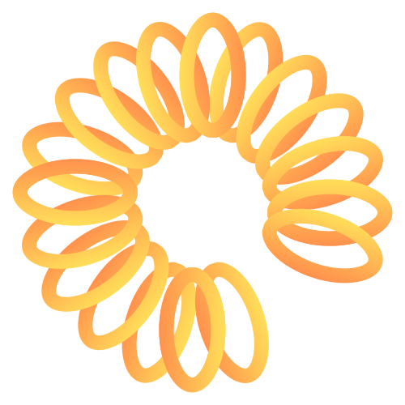

<h1 align="center">Luminy</h1>

Este é um TCC focado em desenvolvimento que tem como ideal trazer o ambiente de iluminação para objetos e paisagens bidimensionais
Trabalhos Similares (Relight): https://clipdrop.co/relight

 
 O trabalho será feito em python e irá recuperar uma imagem em formato png e uma posição de luz dentro da imagem para realizar uma segmentação, detecção de profundidade de cada uma dos grupos segmentados, para por fim executar uma série de calculos sobre cada pixel, para iluminar a imagem de maneira consisa e coesa

30/03/2024 - Hoje realizei a criação de funções para geração de um documento xlsx e imagens para criação dos dados futuros

Indicador de comparação objetivo

SSIM -  STRUCTURE SIMILARITY 
MSE 

--------------------------------

Base de imagens

Quantidade de imagens - 500 até 1000

se não encontrar base de imagens

quantidade de imagens 10 pelo menos

--------------------------------

Fazer comparação utilizando padrões de cor
